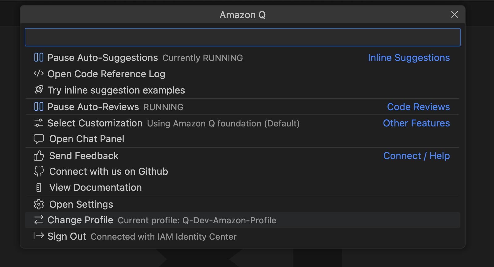
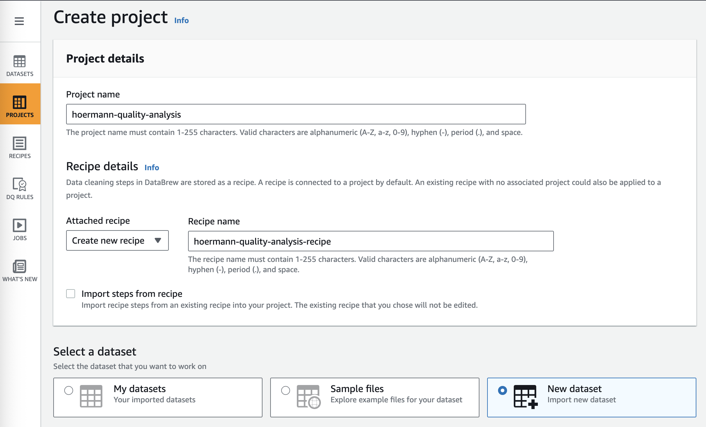
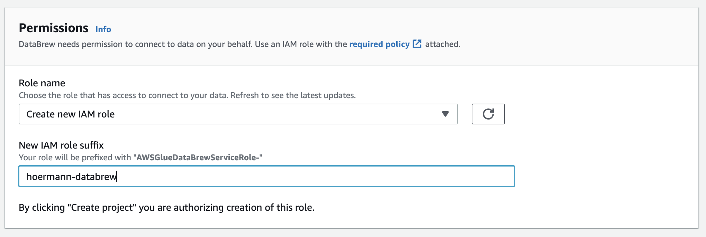
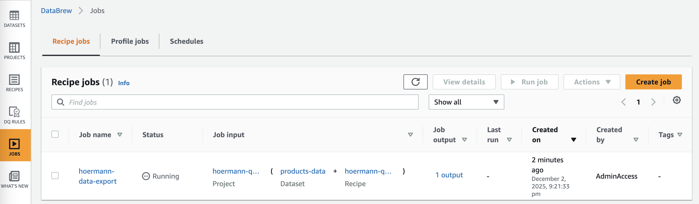
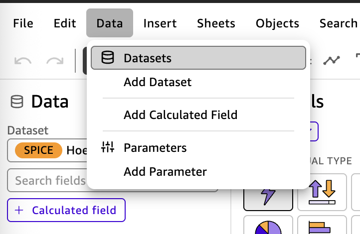
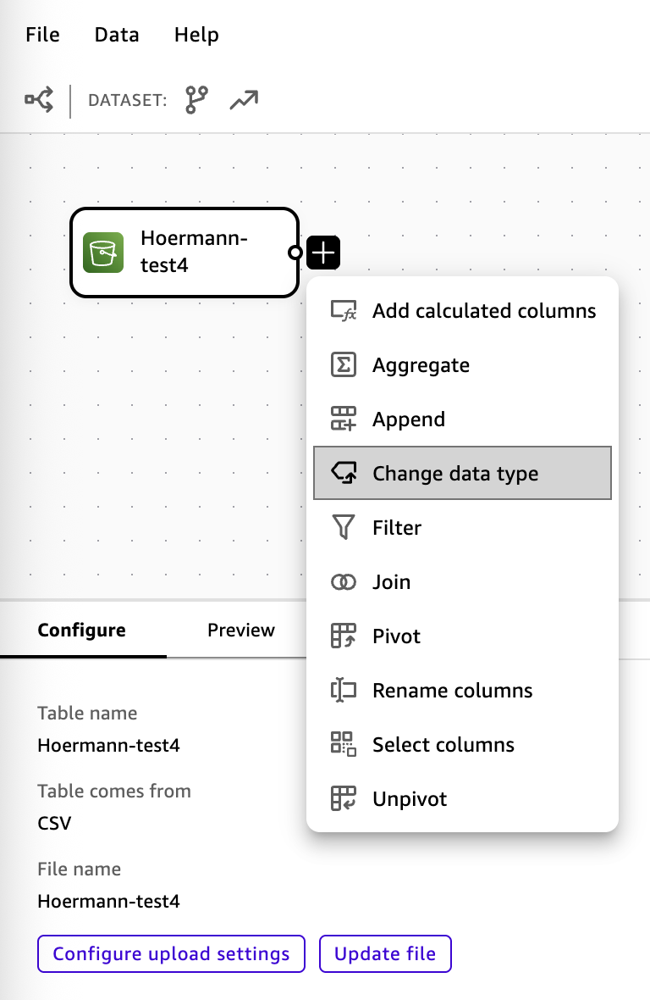
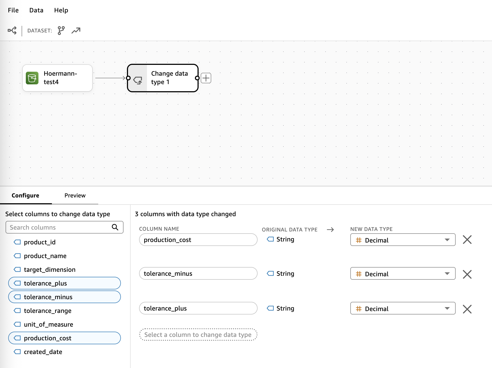

# Hörmann Entwicklertag - Analytics Workstream [L100]

**Dauer**: 1,5-2 Stunden  
**Ziel**: Schritt-für-Schritt Einführung in AWS Analytics mit Amazon Q Developer

## Inhaltsverzeichnis

- [Ihr Szenario](#ihr-szenario)
- [Task 0: Arbeitsbereich vorbereiten](#task-0-arbeitsbereich-vorbereiten)
- [Task 1: Amazon Q Developer Setup überprüfen](#task-1-amazon-q-developer-setup-überprüfen)
- [Task 2: Amazon Q Developer kennenlernen](#task-2-amazon-q-developer-kennenlernen)
- [Task 3: Zurück zum echten Problem - SQL reparieren](#task-3-zurück-zum-echten-problem---sql-reparieren)
- [Task 4: Testdaten mit CSV erstellen](#task-4-testdaten-mit-csv-erstellen)
- [Task 5: AWS-Verbindung einrichten](#task-5-aws-verbindung-einrichten)
- [Task 6: S3-Bucket erstellen](#task-6-s3-bucket-erstellen)
- [Task 7: CSV-Datei in S3-Bucket hochladen](#task-7-csv-datei-in-s3-bucket-hochladen)
- [Task 8: CSV-Daten mit Athena abfragen](#task-8-csv-daten-mit-athena-abfragen)
- [Task 9: Daten mit AWS Glue DataBrew vorbereiten](#task-9-daten-mit-aws-glue-databrew-vorbereiten)
- [Task 10: Neue Spalte in DataBrew erstellen](#task-10-neue-spalte-in-databrew-erstellen)
- [Task 11: Daten mit QuickSight visualisieren](#task-11-daten-mit-quicksight-visualisieren)

---

## Ihr Szenario

Sie arbeiten im Qualitätsteam bei Hörmann. Ihr größter Kunde - TurboMotors AG - braucht bis Freitag eine digitale Lösung für Qualitätsdaten. Die bisherigen Excel-Makros zur Datenaufbereitung sind nicht mehr skalierbar und ausreichend. TurboMotors hostet bereits ihre **gesamte IT-Infrastruktur auf AWS**.

Problem: Die IT-Abteilung ist diese Woche vollständig mit dem ERP-Update beschäftigt, Ihr Kollege aus der Entwicklung wurde zu einem kritischen Projekt abgezogen. Er hat Ihnen seine angefangenen SQL-Skripte hinterlassen: "Da sind noch Fehler drin - **probieren Sie Amazon Q Developer aus**, wir haben gerade eine Lizenz erhalten!"

Der Kunde wartet. Zeit zu zeigen, was Sie können!

> [!CAUTION]
> **Sie müssen diese Tasks befolgen**: Zu jedem Task gibt es eine Frage, die Sie korrekt beantworten müssen, um fortzufahren. Geben Sie Ihre Antworten hier ein: [Test System Link]

---

## Task 0: Arbeitsbereich vorbereiten

### Aufgabe
Erstellen Sie einen Ordner für das heutige Projekt:

1. **Wählen Sie einen Ort** (z.B. Desktop, Dokumente, oder einen anderen Ordner Ihrer Wahl)
2. **Erstellen Sie einen neuen Ordner** mit dem Namen: `Hoermann-Entwicklertag-09_12_2025`
3. **Öffnen Sie diesen Ordner** in Ihrer IDE (VSCode, IntelliJ, etc.) - hier werden wir alle Dateien für den Workshop speichern

> [!TIP]
> **IDE öffnen**: File → Open Folder oder **Cmd+O** (Mac) / **Ctrl+O** (Windows/Linux)

---

## Task 1: Amazon Q Developer Setup überprüfen

### Aufgabe
Stellen Sie sicher, dass Amazon Q Developer korrekt eingerichtet ist:

**Überprüfung 1: Login-Status**
1. **Schauen Sie in die untere Statusleiste** - dort sollten Sie ein Play-Button ▶️ und "Amazon Q" sehen
2. **Klicken Sie darauf** - im mittleren Bereich sollte Ihr Profil angezeigt werden

   <div align="center">
   
   </div>

3. **Alternative**: Klicken Sie auf das **Q-Symbol** in der linken Menüleiste - Sie sollten das Chat-Fenster sehen, **nicht** ein Login-Fenster

**Überprüfung 2: Plugin-Version**
1. **Klicken Sie auf das Extensions-Symbol** (Würfel-Icon) im linken Menü
2. **Suchen Sie "Amazon Q"** in der Liste
3. **Stellen Sie sicher**: Sie verwenden die neueste Version und sehen **keinen** "Refresh"-Button

> [!TIP]
> Falls Sie Probleme haben: Fragen Sie einen AWS Solutions Architect um Hilfe!

> [!CAUTION]
> **Q1**: Überprüfen Sie in der IDE: "Was ist die aktuelle Version des Q Developer Plugins?"

---

## Task 2: Amazon Q Developer kennenlernen

### Aufgabe
Bevor wir mit den technischen Aufgaben beginnen, machen wir uns mit unserem wichtigsten Werkzeug vertraut:

**Modell-Auswahl überprüfen:**
- Stellen Sie sicher, dass ein **Claude Sonnet-Modell** ausgewählt ist (empfohlen für komplexere Aufgaben)

> [!TIP]
> **Q Developer (Sonnet und Haiku Modelle) versteht Deutsch** - Sie können alle Fragen auf Deutsch stellen.

**Fragen Sie Amazon Q Developer:**
- "Erzähle mir einen deutschen Witz mit Q Developer"
- "Wie lautet die Excel-Syntax mit deutschen Funktionsnamen, um den Durchschnitt von Zellen A1 bis A10 zu berechnen, wenn z.B. die Zelle eine gerade Zahl enthält?"
- "Was ist der Unterschied zwischen einer Excel-Datei und einer Datenbank?"

### Erwartetes Ergebnis
Sie verstehen, wie Q Developer Ihnen bei jedem Schritt helfen kann und warum wir von Excel zu AWS-Services wechseln.

> [!CAUTION]
> **Q2**: "Was ist die Versionsnummer des neuesten verfügbaren Modells in Q Developer?"

---

## Task 3: Zurück zum echten Problem - SQL reparieren

### Jetzt wird's ernst!
Nachdem Sie Q Developer kennengelernt haben, können wir das echte Problem aus unserem Szenario angehen: Die defekten SQL-Skripte Ihres Kollegen reparieren!

### Aufgabe: Repariere das defekte SQL-Datenbankskript

**Szenario**: Ihr Kollege hat begonnen, eine Datenbank zur Verfolgung der Produktqualität zu erstellen, aber mehrere Fehler im SQL-Skript hinterlassen. Die Datenbank soll Informationen über hergestellte Produkte einschließlich ihrer Zielabmessungen und Toleranzen speichern.

**Wichtig**: Stellen Sie sicher, dass die Tabelle einen **ordnungsgemäßen Primärschlüssel (primary key)** definiert hat! 

> [!TIP]
> **Die product_id** soll **der Primärschlüssel** sein - verwenden Sie Q Developer, um die richtige Syntax herauszufinden.

### Anweisungen

**Schritt 1: Neue Datei erstellen**
Lassen Sie Q Developer eine neue Datei `products_schema.sql` erstellen und das defekte SQL-Skript hineinkopieren. An diesem Punkt können Sie den unten stehenden Code 1:1 in das Chat-Fenster kopieren.

**Schritt 2: Skript analysieren**
Schauen Sie sich das defekte SQL-Skript an und identifizieren Sie die Probleme anhand der Kommentare.

**Schritt 3: Skript reparieren**
Verwenden Sie Amazon Q Developer, um alle Probleme in diesem Skript zu identifizieren und zu beheben:

```sql
-- DEFEKTES SQL-SKRIPT - Mit Amazon Q Developer reparieren
-- Lesen Sie die Kommentare Ihres Kollegen - sie geben Hinweise auf die Probleme!
CREATE TABLE products (
    product_id VARCHAR(20),                    -- Sollte eindeutig identifizierbar sein
    product_name VARCHAR(100),                 -- Darf niemals leer sein
    target_dimension DECIMAL(8,3),            -- Zielgröße in angegebenen Einheiten
    quantity_target DECIMAL(5,0),             -- Geplante Produktionsmenge
    weight_actual DECIMAL(6,3),               -- Tatsächliches Gewicht in kg
    unit_of_measure ENUM('mm', 'cm', 'inch'), -- Ich möchte flexibel verschiedene Einheiten eingeben können
    production_cost MONEY,                    -- Brauche 10 Stellen insgesamt, 2 nach dem Komma
    created_date DATETIME DEFAULT NOW()       -- Syntax-Fehler am Ende
);
```

> [!CAUTION]
> **Q3 - SQL-Reparatur Fragen**: Fragen Sie Q Developer:
> 
> **Q3.1**: "Welches Schlüsselwort fehlt bei product_id, um es zum Primärschlüssel zu machen?"
> 
> **Q3.2**: "Wie stelle ich sicher, dass product_name nie leer ist?"
> 
> **Q3.3**: "Was sollte statt ENUM für unit_of_measure verwendet werden?"
> 
> **Q3.4**: "Welcher Datentyp sollte statt MONEY für Kosten verwendet werden?"
> 
> **Q3.5**: "Was fehlt nach created_date DATETIME DEFAULT NOW()?"

---

## Task 4: Testdaten mit CSV erstellen

### Jetzt wird's kreativ!
Nachdem Sie das SQL-Skript repariert haben, brauchen wir Testdaten für unsere Produkttabelle.

### Aufgabe: CSV-Datei mit Testdaten erstellen

**Schritt 1: CSV-Datei mit Testdaten erstellen**
Fragen Sie Q Developer, eine CSV-Datei mit 50 Zeilen Testdaten zu erstellen und als `products_testdata.csv` in Ihrem Projektordner zu speichern:
- **product_id**: Format "PART001", "PART002", etc.
- **product_name**: Deutsche Produktnamen (z.B. "Lagergehäuse", "Wellenverbinder", "Montagebügel")
- **target_dimension**: Zufällige Werte zwischen 5.000 und 100.000
- **quantity_target**: Geplante Stückzahl zwischen 100 und 5000
- **weight_actual**: Tatsächliches Gewicht zwischen 0.5 und 25.0 kg
- **unit_of_measure**: "mm", "cm", oder "inch"
- **production_cost**: Kosten zwischen 5.00 und 150.00
- **created_date**: Aktuelle Datum/Zeit

<details>
<summary>📝 Beispiel-Prompt (zum Kopieren)</summary>

```
Erstelle mir eine CSV-Datei namens "products_testdata.csv" mit 50 Zeilen Testdaten für eine Produkttabelle mit folgenden Spalten:

- product_id: Format PART001, PART002, etc.
- product_name: Deutsche Produktnamen wie "Lagergehäuse", "Wellenverbinder", "Montagebügel"
- target_dimension: Zufällige Dezimalwerte zwischen 5.000 und 100.000
- quantity_target: Geplante Stückzahl zwischen 100 und 5000
- weight_actual: Tatsächliches Gewicht zwischen 0.5 und 25.0 kg
- unit_of_measure: Zufällig "mm", "cm" oder "inch"
- production_cost: Kosten zwischen 5.00 und 150.00
- created_date: Aktuelles Datum und Zeit

Bitte mit Header-Zeile und als CSV-Format ausgeben und die Datei in meinem Projektordner speichern.
```

</details>

**Schritt 2: Datei überprüfen**
Überprüfen Sie, ob die Datei `products_testdata.csv` korrekt in Ihrem Projektordner erstellt wurde.

> [!CAUTION]
> **Q4**: Fragen Sie Q Developer: "Wie lautet die Excel-Formel mit deutschen Funktionsnamen, um die Abweichung zwischen Zielwert (Spalte C) und Messwert (Spalte D) zu berechnen und nur dann anzuzeigen, wenn die Abweichung größer als die Toleranz (Spalte E) ist? Erste Datenzeile ist B2."

---

## Task 5: AWS-Verbindung einrichten

*[Wird später ergänzt - abhängig von der Account-Konfiguration]*

---

## Task 6: S3-Bucket erstellen

### Jetzt wird's AWS!
Zeit, Ihre erste AWS-Ressource zu erstellen - einen S3-Bucket für Ihre Daten.

### Aufgabe: S3-Bucket mit Q Developer erstellen

**Wichtig**: S3-Bucket-Namen müssen **global eindeutig** sein! Verwenden Sie eine Kombination aus "hoermann", Ihrem Namen und einer Zufallszahl.

**Beispiel-Name**: `hoermann-workshop-max-12345`

<details>
<summary>📝 Beispiel-Prompt (zum Kopieren)</summary>

```
Erstelle mir einen neuen S3-Bucket mit folgenden Eigenschaften:

- Name: hoermann-workshop-[mein-name]-[zufallszahl] (z.B. hoermann-workshop-anna-67890)
- Region: eu-central-1 (Frankfurt)
- Keine Versionierung
- Kein öffentlicher Zugriff (alle Public Access Blocks aktiviert)
- Keine ACL-Berechtigung
- Standard-Verschlüsselung aktiviert

Bitte erstelle den Bucket und bestätige die Erstellung.
```

</details>

> [!CAUTION]
> **Q5.1**: "Ist der S3-Bucket-Name 'Hoermann-Workshop-2024' gültig? (Ja/Nein)"
> 
> **Q5.2**: "Werden S3-Buckets in einer bestimmten Region erstellt oder werden sie global in nur einer Region erstellt? (Ja/Nein)"

---

## Task 7: CSV-Datei in S3-Bucket hochladen

### Daten in die Cloud!
Jetzt laden wir Ihre `products_testdata.csv` in den neu erstellten S3-Bucket hoch.

### Aufgabe: Datei-Upload mit Q Developer

**Schritt 1: Upload mit Q Developer**
Fragen Sie Q Developer, Ihre CSV-Datei in den S3-Bucket hochzuladen.

<details>
<summary>📝 Beispiel-Prompt (zum Kopieren)</summary>

```
Lade die Datei "products_testdata.csv" aus meinem Projektordner in meinen S3-Bucket "hoermann-workshop-[meinname]-[zahl]" hoch.

Verwende dabei:
- Standard-Speicherklasse
- Server-side Verschlüsselung
- Keine öffentlichen Berechtigungen
```

</details>

**Alternative: Manueller Upload über AWS-Konsole**
Falls Q Developer keinen direkten Zugriff hat:
• AWS-Konsole öffnen → S3-Service
• Ihren Bucket auswählen → "Upload" klicken
• `products_testdata.csv` auswählen und hochladen
• Standard-Einstellungen beibehalten

> [!CAUTION]
> **Q6**: "Wie heißt die günstigste S3-Speicherklasse?"

---

## Task 8: CSV-Daten mit Athena abfragen

### SQL in der Cloud!
Bevor wir die Daten transformieren, lernen wir, wie man CSV-Dateien direkt in S3 mit SQL abfragen kann.

### Aufgabe: Athena-Tabelle erstellen und Daten abfragen

**Schritt 1: Athena öffnen**
- AWS-Konsole → "Athena" suchen
- **Query editor** öffnen (aus der linken Menüleiste innerhalb des Athena-Services)
- **Workgroup**: "primary" beibehalten

**Schritt 1.5: Query Result Location einrichten**
> [!IMPORTANT]
> **Bevor Sie Ihre erste Abfrage ausführen, müssen Sie einen Query Result Location in Amazon S3 einrichten.**

1. **"Settings"** Tab klicken (oben rechts im Query Editor)
2. **"Manage"** klicken bei "Query result location"
3. **S3 location**: `s3://hoermann-workshop-[ihr-name]-[nummer]/athena-results/` eingeben
4. **"Save"** klicken

**Schritt 2: Datenbank erstellen (falls nicht vorhanden)**
```sql
CREATE DATABASE IF NOT EXISTS hoermann_db;
```

**Schritt 3: Externe Tabelle erstellen**
Kopieren Sie diesen SQL-Code und passen Sie den S3-Pfad an:

```sql
CREATE EXTERNAL TABLE hoermann_db.manufacturing_data (
  product_id string,
  product_name string,
  target_dimension double,
  quantity_target double,
  weight_actual double,
  unit_of_measure string,
  production_cost double,
  created_date string
)
ROW FORMAT SERDE 'org.apache.hadoop.hive.serde2.lazy.LazySimpleSerDe'
WITH SERDEPROPERTIES (
  'field.delim' = ',',
  'skip.header.line.count' = '1'
)
STORED AS TEXTFILE
LOCATION 's3://hoermann-workshop-[ihr-name]-[nummer]/'
TBLPROPERTIES ('has_encrypted_data'='false');
```

> [!TIP]
> **Wichtig**: Ersetzen Sie `[ihr-name]-[nummer]` mit Ihrem tatsächlichen Bucket-Namen!

**Schritt 4: Daten testen**
Führen Sie diese Abfragen aus:

```sql
-- Alle Daten anzeigen
SELECT * FROM hoermann_db.manufacturing_data LIMIT 10;

-- Teure Produkte finden
SELECT product_name, production_cost, unit_of_measure
FROM hoermann_db.manufacturing_data 
WHERE production_cost > 20 
ORDER BY production_cost DESC;

-- Durchschnittliche Kosten pro Einheit
SELECT unit_of_measure, 
       AVG(production_cost) as avg_cost,
       COUNT(*) as product_count
FROM hoermann_db.manufacturing_data 
GROUP BY unit_of_measure;
```

**Schritt 5: Quantity/Weight-Analyse**
Fragen Sie Q Developer, eine SQL-Abfrage zu erstellen, die:
- Produkte mit hoher geplanter Stückzahl identifiziert (quantity_target > 1000)
- Das Verhältnis von Gewicht zu geplanter Menge berechnet (weight_actual / quantity_target)
- Nach diesem Verhältnis sortiert

> [!CAUTION]
> **Q8**: "Welches SQL-Schlüsselwort wird verwendet, um externe Tabellen in Athena zu erstellen?"

---

## Task 9: Daten mit AWS Glue DataBrew vorbereiten

### Daten aufbereiten wie ein Profi!
Jetzt bereiten wir Ihre CSV-Daten mit AWS Glue DataBrew auf und fügen neue Spalten hinzu.

### Aufgabe: DataBrew-Projekt erstellen

**Schritt 1: DataBrew öffnen**
- AWS-Konsole → "Glue DataBrew" suchen
- **"Create project"** klicken (nicht "Create sample project")

**Schritt 2: Projekt konfigurieren**
- **Project name**: `hoermann-quality-analysis`
- **Recipe**: "Create new recipe" auswählen (Standard)
- **Recipe name**: `hoermann-data-prep` (wird automatisch ausgefüllt)

**Schritt 3: Dataset auswählen**
- **"New dataset"** klicken
- **Dataset name**: `products-data`
- **Source**: S3 auswählen
- **S3 location**: Zu Ihrem `hoermann-workshop-[name]-[nummer]` Bucket navigieren
- **File**: `products_testdata.csv` auswählen (die Daten, die wir in Task 7 hochgeladen haben)

**Schritt 4: Einstellungen**
- **Selected file type**: CSV auswählen
- **CSV delimiter**: Komma (,) - Standard beibehalten
- **Column header values**: "Treat first row as header" auswählen
- **Sampling**: "First 500 rows" beibehalten (Standard)

<div align="center">

</div>

- **Permissions**: DataBrew Service Role auswählen (wird vorgeschlagen)

<div align="center">

</div>

- **"Create project"** klicken

> [!TIP]
> Die Kostenwarnung ist normal - DataBrew berechnet pro Session, Workshop-Nutzung ist minimal.

**Schritt 5: Neue Spalte hinzufügen**
Fragen Sie Q Developer, wie Sie eine neue Spalte erstellen können (wird in Task 10 implementiert):

<details>
<summary>📝 Beispiel-Prompt (zum Kopieren)</summary>

```
In AWS Glue DataBrew möchte ich eine neue Spalte "efficiency_ratio" erstellen, die das Verhältnis von quantity_target zu weight_actual berechnet (quantity_target / weight_actual).

Wie erstelle ich diese berechnete Spalte in DataBrew?
```

</details>

> [!CAUTION]
> **Q9**: "Wie nennt man eine Sammlung von Datentransformationsschritten in DataBrew?"

---

## Task 10: Neue Spalte in DataBrew erstellen

### Daten transformieren!
Jetzt erstellen wir eine neue berechnete Spalte in Ihrem DataBrew-Projekt.

### Aufgabe: efficiency_ratio Spalte hinzufügen

**Teil 1: Spalte erstellen**
1. **"Create"** → **"Column"** → **"Based on a function"** klicken
2. **Function**: "Divide" auswählen
3. **Values using**: "Source columns" auswählen
4. **Erste Spalte**: `quantity_target` auswählen
5. **Zweite Spalte**: `weight_actual` auswählen
6. **Destination column**: `efficiency_ratio` eingeben
7. **Apply transform to**: "All rows" beibehalten
8. **"Apply"** klicken

**Teil 2: Spalte formatieren**
1. **Auf den Spaltennamen** `efficiency_ratio` klicken
2. **"Format"** → **"Decimal precision"** auswählen
3. **"2 decimal places"** eingeben
4. **"Apply"** klicken

**Teil 3: Job erstellen und Daten speichern**
1. **"Create job"** klicken
2. **Job name**: `hoermann-data-export` eingeben
3. **Job type**: "Recipe job" beibehalten (Standard)
4. **Associated dataset**: `products-data` (automatisch ausgewählt)
5. **Associated recipe**: `hoermann-quality-analysis-recipe` (automatisch ausgewählt)

**Job Output Settings:**   
6. **Output location**: Ihr S3-Bucket auswählen (z.B. `s3://hoermann-workshop-[name]-[nummer]/output/`)   
7. **File type**: CSV beibehalten   
8. **File output**: "Autogenerate files" beibehalten   

**Advanced Settings:**   
9. **Maximum number of units**: 5 beibehalten (Standard)   
10. **Job timeout**: 2880 Minuten beibehalten   
11. **CloudWatch logs**: Aktivieren (empfohlen)   

**Permissions:**   
12. **Role**: Neue DataBrew Job Service Role erstellen → `DataBrewJobServiceRole-hoermann-workshop`   
13. **Auf den orangenen Button** **"Create and run job"** klicken

<div align="center">

</div>

> [!TIP]
> Der Job dauert einige Minuten. Die transformierte CSV-Datei wird in Ihrem S3-Bucket gespeichert.

> [!CAUTION]
> **Q10**: "Welche Funktion wird verwendet, um zwei Spalten zu addieren?"

---

## Task 11: Daten mit QuickSight visualisieren

### Dashboards erstellen!
Jetzt erstellen wir ein Dashboard mit den transformierten Daten aus DataBrew.

### Aufgabe: QuickSight Dashboard erstellen

**Schritt 1: Manifest-Datei vorbereiten**
1. **Neue Datei erstellen**: Erstellen Sie eine neue Datei `hoermann-manifest.json` in Ihrer IDE
2. **Code kopieren**: Kopieren Sie den unten stehenden Code in die Datei
3. **Bucket-Namen anpassen**: Ersetzen Sie `<ihr-bucket-name>` mit Ihrem tatsächlichen S3-Bucket-Namen
4. **Datei speichern**: Speichern Sie die Datei in Ihrem Projektordner
5. **Datei hochladen**: Laden Sie die Manifest-Datei in Ihren S3-Bucket hoch

<details>
<summary>📄 Manifest-Datei Inhalt (zum Kopieren)</summary>

```json
{
    "fileLocations": [
        {
            "URIs": [
                "s3://<ihr-bucket-name>/hoermann-data-export_*_part00000.csv"
            ]
        }
    ],
    "globalUploadSettings": {
        "format": "CSV",
        "delimiter": ",",
        "containsHeader": "true"
    }
}
```

</details>

**Schritt 2: QuickSight öffnen**
1. **AWS-Konsole** → "QuickSight" suchen
2. **QuickSight Berechtigungen einrichten**:
   - **"Integrations"** → **"S3"** → **"New"**
   - **Ihren S3-Bucket** auswählen und aktivieren
3. **"Analyses"** im linken Menübereich klicken
4. **Lila "Create analysis"** Button klicken
5. **"Create dataset"** klicken (oben rechts)
6. **"Create data source"** klicken
7. **"Amazon S3"** auswählen → **"Next"** klicken

**Schritt 3: Datenquelle konfigurieren**
1. **Data source name**: `hoermann-quality-data`
2. **"Upload a manifest file"** auswählen
3. **Manifest-Datei hochladen**: Laden Sie zuerst die `hoermann-manifest.json` Datei in Ihren S3-Bucket hoch (über IDE oder AWS Console)
4. **S3 URL eingeben**: `s3://<ihr-bucket-name>/hoermann-manifest.json`
5. **"Connect"** klicken

**Schritt 4: Analysis öffnen**
1. **Auf die neu erstellte Analysis klicken** (Sie werden zur Dashboard-Oberfläche navigiert)
2. **"Data"** → **"Datasets"** im horizontalen Menü klicken
3. **"Datasets in this analysis"** Tab auswählen
4. **Drei vertikale Punkte** auf der rechten Seite klicken → **"Edit"** auswählen
5. Sie werden zu einer neuen Seite navigiert, wo Sie die Daten vorbereiten können

<div align="center">

</div>

**Schritt 5: Datentypen anpassen**
1. **Auf der Dataset Editor Seite**: Neben der Datenquelle finden Sie einen **+ Button**
2. **+ Button klicken** → **"Change data type"** auswählen

<div align="center">

</div>

3. **Numerische Felder auswählen**: Klicken Sie auf alle numerischen Spalten:
   - `target_dimension`
   - `quantity_target`
   - `weight_actual`
   - `production_cost`
   - `efficiency_ratio`
4. **Datentyp ändern**: Von **String** → **Decimal** auswählen

<div align="center">

</div>

> [!NOTE]
> Dies ist ein Beispielbild. Sie müssen die oben aufgelisteten numerischen Felder auswählen.

5. **"Publish and visualize"** klicken

<div align="center">

</div>

> [!NOTE]
> Ab jetzt können Sie beliebige Diagramme, Charts und Visualisierungen erstellen!

> [!TIP]
> Bei korrekter Durchführung sehen Sie eine neue Analyse-Datei in der Liste im **Analyses** Tab.

**Schritt 6: Erste Visualisierung**
1. **Diagrammtyp**: Balkendiagramm auswählen
2. **X-Achse**: `product_name` hinzufügen
3. **Y-Achse**: `efficiency_ratio` hinzufügen
4. **Titel hinzufügen**: "Effizienz-Verhältnis nach Produkt"

> [!CAUTION]
> **Q11**: "Welches Dateiformat wird für QuickSight Manifest-Dateien verwendet?"
